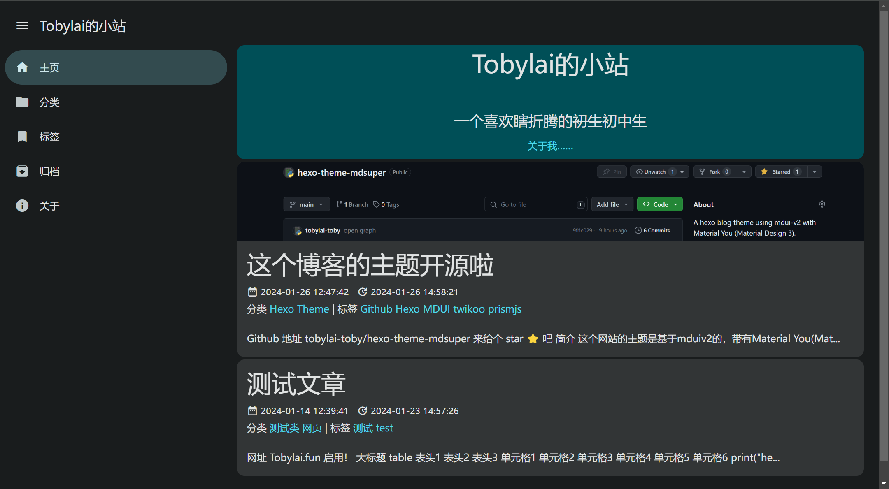

# hexo-theme-mdsuper


一个使用 [mdui-v2](https://mdui.org) 的 Material You (Material Design 3) 风格的 [hexo](https://hexo.io) 博客主题。
支持 [twikoo](https://twikoo.js.org) 评论系统和 [Prismjs](https://prismjs.com/) 高亮。

## 特性
- front-matter `photos` 图库 (使用 fancybox & carousel)
- prismjs 代码高亮
- 评论系统
- comment systems support
  - [twikoo](https://twikoo.js.org)
  - [gitalk](https://github.com/gitalk/gitalk)
  - [waline](https://waline.js.org)
  
- mdui v2
- fancybox 图片点击放大
- 文章的本地搜索 (需要 [wzpan/hexo-generator-search](https://github.com/wzpan/hexo-generator-search))

## 安装
```bash
cd your-hexo-site/
git clone https://github.com/tobylai-toby/hexo-theme-mdsuper.git themes/mdsuper
```
### 激活
去 `your-hexo-site/_config.yml` 把主题改成 `mdsuper`
```yaml
theme: mdsuper
language: zh-CN # 默认是 en(default.yml)
# 中文改成 zh-CN
```
## Prismjs
mdsuper 使用 [prismjs](https://prismjs.com/) 高亮代码.

`prism.js` 和 `prism.css` 已经包括在主题里了， 但是仍然建议你去使用一个自定义了的`prism`因为这样你可以选择要启用的语言或插件。

去 [prismjs download](https://prismjs.com/download.html) 下载一个自定义的版本
- 移动 `prism.js` 到 `your-hexo-site/themes/mdsuper/source/js/prism.js`
- 移动 `prism.css` 到 `your-hexo-site/themes/mdsuper/source/css/prism.css`

## 文章封面
```markdown
---
title: 
date: 
tags: 
categories: 
cover: 封面URL
---
```

## 内置页面布局
- `post`: 文章布局
- `onlycontent`: 只有内容的布局 (评论依然可用，使用frontmatter`comments: false`关闭)

## 配置
去 `your-hexo-site/themes/mdsuper/_config.yml` 进行配置
```yaml
theme:
  colorScheme: "#4fd8eb" # 修改主题颜色
  layout: dark # dark | light | auto 暗/亮/跟随系统

favicon: "" # path( or url) of avatar such as /favicon.png

drawer: # 这里是抽屉导航
  always_open: true
  menu: 
    Home: # 显示的文字
      icon: home # mdui图标名
      url: /
    ...

copyright: "" # 页面底部版权信息 例如 © <date> <name>

comment:
  system: none # none | twikoo | gitalk
  twikoo:  # see: https://twikoo.js.org/frontend.html
    cdn: 
      js: /js/twikoo.all.min.js # or use cdn such as https://cdn.bootcdn.net/ajax/libs/twikoo/1.6.31/twikoo.all.min.js
    
    # twikoo settings:
    envId: ""
    region: '' # region, see twikoo documentation
    path: location.pathname # will eval this, be careful
    lang: 'zh-CN' 
  gitalk: # see https://github.com/gitalk/gitalk
    cdn:
      css: /css/gitalk.css
      js: /js/gitalk.min.js

    # gitalk settings:
    clientID: '' # GitHub Application Client ID
    clientSecret: '' # GitHub Application Client Secret
    repo: '' # GitHub repo
    owner: '' # GitHub repo owner
    admin: [] # GitHub repo owner and collaborators, only these guys can initialize github issues
    id: decodeURIComponent(location.pathname)# will eval this, be careful
    # this is like /2024/01/24/xxxxxxxxxx ,make sure the length < 50
    # Ensure uniqueness and length less than 50
    distractionFreeMode: false  # Facebook-like distraction free mode
    #proxy: 
    # you may need a reverse proxy to support cors, default url may not work in some places(such as cn)
  waline:
    # ...

# display in the card at the top of the page under the subtitle
display_index_top:
  text: "dev-mdsuper"
  avatar: "" # path( or url) of avatar such as /avatar.png

# assets
mdui:
  css: https://unpkg.com/mdui@2.0.3/mdui.css
  js: https://unpkg.com/mdui@2.0.3/mdui.global.js

# 安装 https://github.com/wzpan/hexo-generator-search 并按照README进行配置
search:
  enable: true
  xml: /search.xml # only supports xml
```
## 预览站点
[Tobylai.fun](https://tobylai.fun)